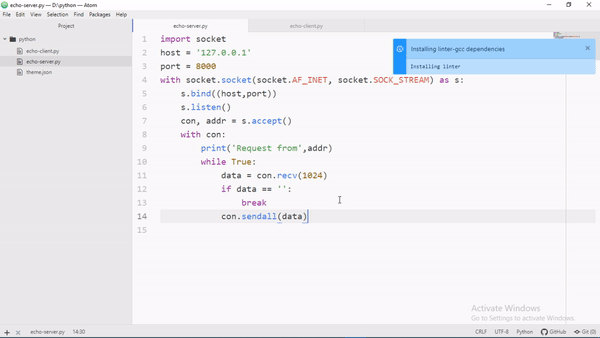

# project-specific-theme package

Sets specific theme for specific project.
Enable it and forget about changing themes everytime you shift to another project. Just hit toggle from **Packages->project-specific-theme->toggle** or **ctrl+alt+a** when atom open your project to change it to custom theme.

### Note: If you're using git add the 'theme.json' file in your project directory to '.gitignore' file manually.

### Note:Make sure only one instance of atom is running and close other projects before toggling this package. Otherwise, **all the project themes will be set to this theme**.

## Example

## Contibutions :sunglasses:
* Fork the repo.
* Push changes.
* Make a PR.

## Issues :innocent:
Create a issue ticket for complains and suggestions.

Note: This package doesn't come with any pre built theme, so if you uninstall the theme it will set to default.

Made with :heart: and :coffee:

License: [MIT](https://github.com/anirudhjaishankar/project-specific-theme/blob/master/LICENSE.md)
